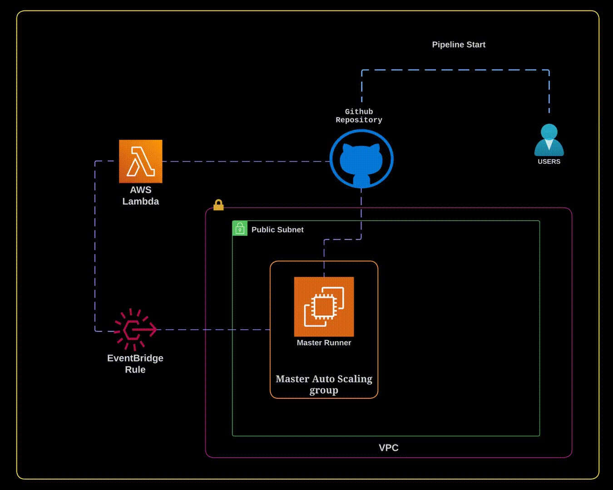

# GitHub Actions Master-Slave Setup with EC2 and Lambda

This project is a step-by-step approach to building a robust and automated GitHub Actions workflow on AWS using a master-slave architecture. By using EC2 instances for runners and Lambda functions and EventBridge for deregistration, we achieve a highly available and efficient CI/CD pipeline.

## Architecture



## Prerequisites

- AWS CLI installed and configured
- GitHub Personal Access Token (PAT) with `repo` and `admin:repo_hook` permissions
- Basic understanding of AWS IAM, EC2, and Lambda services

## Steps to Set Up Master Server

### Step 1. Create a GitHub Personal Access Token (PAT)

Generate a personal access token by navigating to:

1. GitHub Account > Settings > Developer Settings > Personal Access Tokens.
2. Create a new token with `repo` and `admin:repo_hook` scopes.
3. Save this token, as it will be used to authenticate with the GitHub API.

### Step 2. Store the PAT in AWS Systems Manager (SSM) Parameter Store

Create a Parameter Store variable to store Github PAT
or
Use the following command to store your GitHub PAT as a secure parameter in SSM:

```bash
aws ssm put-parameter \
  --name "github/personal_access_token" \
  --value "YOUR_PERSONAL_ACCESS_TOKEN" \
  --type "SecureString"
```

### Step 3: Create an IAM Role for Master EC2 Instance

1. Go to the **IAM** section in the AWS console and click on **Roles**.
2. Click **Create role**, choose **EC2** as the trusted entity, and click **Next**.
3. Make sure to add following permissions:

```json
  "Statement": [
    {
      "Effect": "Allow",
      "Action": [
        "ssm:GetParameter",
        "ssm:GetParameters",
        "ssm:GetParameterHistory"
      ],
      "Resource": "arn:aws:ssm:REGION:ACCOUNT_ID:parameter/PARAMETER_NAME"
      # Replace the `REGION`,`ACCOUNT_ID` and `PARAMETER_NAME` with your values.
    }
  ]
```

4. Click **Next** and complete the role creation process by assigning a name to your role, such as `GitHubActionsRunnerRole`.

### Step 4. Setup a Security Group

Create a security group that allows:

1. Inbound traffic on port 22 (for SSH access).
2. Outbound traffic (required for communication with GitHub).

### Step 5. Create an EC2 Launch Template

Create a launch template that uses the IAM role and security group from the previous steps. Ensure that the option to **Auto-assign Public IP** is enabled from **Advanced Network Configuration** during creation.

Use the following user data script for configuring the EC2 instance as a GitHub runner using Amazon Linux AMIs :

```bash
#!/bin/bash

# Installing prerequisites
yum update -y
yum install curl jq docker libicu -y --skip-broken
systemctl enable docker
systemctl start docker
usermod -a -G docker ec2-user
chown ec2-user:docker /var/run/docker.sock
export RUNNER_ALLOW_RUNASROOT=true

# Retrieve GitHub PAT from SSM
export GITHUB_PAT=$(aws ssm get-parameter --name "github/personal_access_token" --with-decryption --query Parameter.Value --output text)

# Configure Master Runner
mkdir /home/ec2-user/github-master-runner
cd /home/ec2-user/github-master-runner
curl -o actions-runner-linux-x64-2.312.0.tar.gz -L https://github.com/actions/runner/releases/download/v2.312.0/actions-runner-linux-x64-2.312.0.tar.gz
tar xzf ./actions-runner-linux-x64-2.312.0.tar.gz
PARAMETER_NAME="PARAMETER_NAME"
REGION="us-east-1"
export OWNER="GITHUB_USERNAME"
export REPO="GITHUB_REPO_NAME"
export TOKEN_JSON=$(curl -L   -X POST   -H "Accept: application/vnd.github+json"   -H "Authorization: Bearer $GITHUB_PAT"   -H "X-GitHub-Api-Version: 2022-11-28"   https://api.github.com/repos/$OWNER/$REPO/actions/runners/registration-token)
export TOKEN=$(echo ${TOKEN_JSON} | jq -r ".token")
printf "${INSTANCE_ID}\n\n" | ./config.sh --url https://github.com/$OWNER/$REPO --token ${TOKEN} --runnergroup Default --name ${INSTANCE_ID} --labels master
./svc.sh install
./svc.sh start
chown -R ec2-user:ec2-user .credentials* .env .path .runner
chown -R ec2-user:ec2-user /home/ec2-user/github-master-runner/* /home/ec2-user/github-master-runner/.

```

Above user data is useful for personal repositories but for repositories under any organization you might have to replace the `OWNER` with the organization name in github.

### Step 6. Create a Lambda Function

The Lambda function is responsible for deregistering the GitHub Actions Master runner when an EC2 instance is terminated. Here's a brief overview of its functionality:

- Fetches the GitHub Personal Access Token from AWS Systems Manager Parameter Store
- Queries the GitHub API to get the list of runners for the repository
- Identifies the runner associated with the terminated EC2 instance
- Deregisters the runner from GitHub

Create a Lambda Function with runtime as `Python 3.x` and while creating execution role make sure it has permission to fetch **SSM Paramter** which stores **Github PAT**

```json
  "Statement": [
    {
      "Effect": "Allow",
      "Action": [
        "ssm:GetParameter",
        "ssm:GetParameters",
        "ssm:GetParameterHistory"
      ],
      "Resource": "arn:aws:ssm:REGION:ACCOUNT_ID:parameter/PARAMETER_NAME"
      # Replace the `REGION`,`ACCOUNT_ID` and `PARAMETER_NAME` with your values.
    }
  ]
```

Lambda Function Code in Python :

```Python
import json
import boto3
import requests

REPO = "REPO_NAME"  # Replace with your GitHub repository name
OWNER = "REPO_OWNER_NAME"  # Replace with your GitHub repository owner name/organization name
PARAMETER_NAME = "PARAMETER_NAME"  # Replace with your SSM parameter name

ssm_client = boto3.client('ssm')

def get_parameter(name):
    try:
        response = ssm_client.get_parameter(Name=name, WithDecryption=True)
        return response['Parameter']['Value']
    except Exception as e:
        print(f"Error fetching SSM parameter '{name}': {str(e)}")
        raise

def get_body(options):
    print("started getbody function")
    try:
        response = requests.request(
            method=options['method'],
            url=options['url'],
            headers=options['headers']
        )
        response.raise_for_status()

        if response.text:
            res = response.json()
            print(res)
            return res
        else:
            return None
    except requests.exceptions.RequestException as e:
        print(f"HTTP Request error: {str(e)}")
        raise

def remove_runner(REPO, instance_id):
    try:
        password = get_parameter(PARAMETER_NAME)
    except Exception as e:
        print(f"Error fetching SSM parameter: {str(e)}")
        raise

    auth = "Bearer " + password
    headers = {
        'Accept': 'application/vnd.github+json',
        'Authorization': auth,
        'X-GitHub-Api-Version': '2022-11-28',
        'User-Agent': OWNER
    }

    try:
        result = get_body({
            'method': 'GET',
            'url': f'https://api.github.com/repos/{OWNER}/{REPO}/actions/runners',
            'headers': headers
        })

        print(f"Removing GitHub self-hosted runner from EC2 instance {instance_id}")
        print(result, isinstance(result, dict))

        off_runners = next((r for r in result['runners'] if r['name'] == instance_id), None)
        print(off_runners, isinstance(off_runners, dict))

        if off_runners:
            get_body({
                'method': 'DELETE',
                'url': f'https://api.github.com/repos/{OWNER}/{REPO}/actions/runners/{off_runners["id"]}',
                'headers': headers
            })
            print(f"GitHub self-hosted runner from EC2 instance {instance_id} removed for REPO {REPO}")
        else:
            print(f"No GitHub self-hosted runner for EC2 instance {instance_id}, skipping for REPO {REPO}")

    except Exception as e:
        print(f"Error: {str(e)}")
        raise

def lambda_handler(event, context):
    print(json.dumps(event))

    if event['detail-type'] != 'EC2 Instance Terminate Successful':
        print(f'No action for event type {event["detail-type"]}')

    instance_id = event['detail']['EC2InstanceId']

    try:
        remove_runner(REPO, instance_id)
    except Exception as e:
        print(f"Error executing Lambda function: {str(e)}")
```

### Step 7. Create an EventBridge Rule

Create an eventbridge rule with custom event pattern and set the target to **Lambda Function** created above.
Event Pattern :

```json
{
  "source": ["aws.autoscaling"],
  "detail-type": ["EC2 Instance Terminate Successful"],
  "detail": {
    "AutoScalingGroupName": ["GITUHB_ACTIONS_ASG_NAME"] #Replace with Autoscaling Group created earlier
  }
}

```

By following above steps we now have following things :

- An Autoscaling Group created using Launch Template
- A lambda Function which will trigger whenever any instance from ASG is terminated to remove runner from Repository/Repositories.

Now we will move on to Slave Setup.

### Steps to Setup Slave Servers :

### Step 1. Create IAM Role for Slave Instances

1. Go to the **IAM** section in the AWS console and click on **Roles**.
2. Click **Create role**, choose **EC2** as the trusted entity, and click **Next**.
3. Make Sure to Add atleast following Permission to this IAM Role :

```json
{
  "Version": "2012-10-17",
  "Statement": [
    {
      "Effect": "Allow",
      "Action": [
        "ec2:ReplaceIamInstanceProfileAssociation",
        "ec2:AssociateIamInstanceProfile"
      ],
      "Resource": "*"
    },
    {
      "Effect": "Allow",
      "Action": "iam:PassRole",
      "Resource": "*"
    },
    {
      "Effect": "Allow",
      "Action": ["ec2:CreateTags"],
      "Resource": "*",
      "Condition": {
        "StringEquals": {
          "ec2:CreateAction": "RunInstances"
        }
      }
    }
  ]
}
```

4. Add other required permission to this IAM Role based on your build job like S3, ECS, EKS, Autoscaling, etc.

### Step 2. Prepare IAM user with AWS access keys

Create new AWS access keys for the new or an existing IAM user with the following least-privilege minimum required permissions:

```json
{
  "Version": "2012-10-17",
  "Statement": [
    {
      "Effect": "Allow",
      "Action": [
        "ec2:RunInstances",
        "ec2:TerminateInstances",
        "ec2:DescribeInstances",
        "ec2:DescribeInstanceStatus"
      ],
      "Resource": "*"
    },
    {
      "Effect": "Allow",
      "Action": ["ec2:CreateTags"],
      "Resource": "*",
      "Condition": {
        "StringEquals": {
          "ec2:CreateAction": "RunInstances"
        }
      }
    }
  ]
}
```

##### Add these **keys** to Github Secrets and also Add **Github PAT** to Github Secrets which will accessed in Github Actions Workflow.

### Step 3. Setup Subnet and Security Group

1. Create Security Group which can be attached the Slave , make sure to open port 22 ( or add SSM policies to IAM Role) to access server in case of any issues.
2. Create a Subnet or Either Use an Existing Subnet which has internet gateway access. In Subnet Settings **Enable Auto-Assign Public IP** , without this github actions runner will not register itself in github repository.

### Step 4. Github Actions Workflow

Following is a sample Workflow file :

```yaml
name: Github Actions Master-Slave Setup
on:
  workflow_dispatch:

permissions:
  id-token: write
  contents: read

jobs:
  # Job Running on Master Server
  start-runner:
    name: Start self-hosted EC2 runner
    runs-on: master
    steps:
      # Using Access Keys created for Slave Server Creation .
      - name: configure aws credentials
        id: creds
        uses: aws-actions/configure-aws-credentials@v4
        with:
          # I have used OIDC here , you can use Access Key and Secret Access Key as well
          role-to-assume: arn:aws:iam::943621111361:role/github-oidc-role
          role-skip-session-tagging: true
          output-credentials: true
          aws-region: ${{ env.AWS_REGION }}
      # Starting Slave Server
      - name: Start EC2 runner
        id: start-ec2-runner
        uses: NextChapterSoftware/ec2-action-builder@v1.9
        with:
          github-token: ${{ secrets.GH_PERSONAL_ACCESS_TOKEN }} # Github PAT stored in Github Secrets
          aws_access_key_id: ${{ steps.creds.outputs.aws-access-key-id }} # generated by configure-aws-credentials
          aws_secret_access_key: ${{ steps.creds.outputs.aws-secret-access-key }} # generated by configure-aws-credentials
          aws_session_token: ${{ steps.creds.outputs.aws-session-token }} # generated by configure-aws-credentials
          aws_region: ${{ env.AWS_REGION }}
          github_job_start_ttl_seconds: 60
          ec2_instance_ttl: 20 #Minutes
          ec2_ami_id: ami-123
          ec2_instance_type: t3.nano
          ec2_subnet_id: subnet-123
          ec2_security_group_id: sg-123
          ec2_instance_iam_role: my-role-name # optional, requires additional permissions
          ec2_spot_instance_strategy: None # Other options are: SpotOnly, BestEffort, MaxPerformance
          ec2_instance_tags: > # optional, requires additional permissions
            [
              {"Key": "GitHubRepository", "Value": "${{ github.repository }}"}
            ]

  # Job where actual build takes place
  deploy-code:
    name: Do the job on the runner
    needs: start-runner # required to start the main job when the runner is ready
    runs-on: ${{ github.run_id }} # run the job on the newly created runner
    steps:
      - name: Hello World
        run: echo 'Hello World!'
```

### Additional Considerations

1. **Security :** Ensure that all access keys and tokens are stored securely in AWS Secrets Manager or GitHub Secrets.
2. **Monitoring and Logging :** It would be beneficial to include logging and monitoring setups for the Lambda function and EC2 instances to ensure visibility into any issues.
3. **Master Runner :** Master Runner can be configured to multiple repositories by modifying user data and Lambda function scripts. Spot Allocation Startegy can be used in Master Autoscaling group to reduce costs.
4. **Slave Runners :** Use `ec2_spot_instance_strategy` variable for slave instances to save costs by using `SpotOnly` or `BestEffort` options.

Remember to prioritize security by securely storing credentials and implement robust monitoring and logging for comprehensive visibility and troubleshooting. By continuously refining and adapting this setup to your specific needs, you unlock a powerful and flexible solution for automating your software development lifecycle within the AWS ecosystem.

**Thank you for taking the time to read this guide!** I hope you found it informative and helpful in setting up your own GitHub Actions workflow on AWS. If you have any questions or feedback, please don't hesitate to reach out on [**LinkedIn**](www.linkedin.com/in/sanket-rajgiri). Happy automating!
